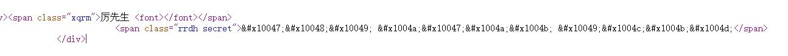
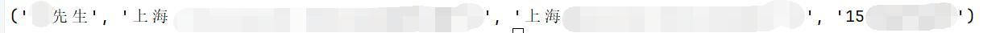

# 供应商网爬虫


## 项目描述

供应商网手机号部分是通过字体混淆生成的，无法直接获取到真实手机号，可以利用OCR技术对字体进行识别，获取出真实号码。




## 安装使用

环境要求

- python >= 3.8
- 安装必要的模块

### 克隆项目

```bash
git clone https://github.com/u-wlkjyy/gyscnSpirder.git
```

### 创建python环境

```bash
conda create -n spider python=3.8
```

```bash
conda activate spider
```

### 安装相关模块

```bash
pip3 install -r requirements.txt
```

#### 使用国内镜像站下载

```bash
pip3 install -r requirements.txt - https://pypi.tuna.tsinghua.edu.cn/simple
```


## 使用示例

```python
from Spider import Spider

name, addr, firm, phone = Spider('https://shanghaiouxin.gys.cn/contact-information/', ).get_information()
```


## 异常信息

当出现访问异常时（IP被屏蔽），将抛出一个``Exception``异常，包含异常信息``The website is protected by anti-spider, please try again later or use a proxy``，建议使用``代理IP``。


## 效果图

